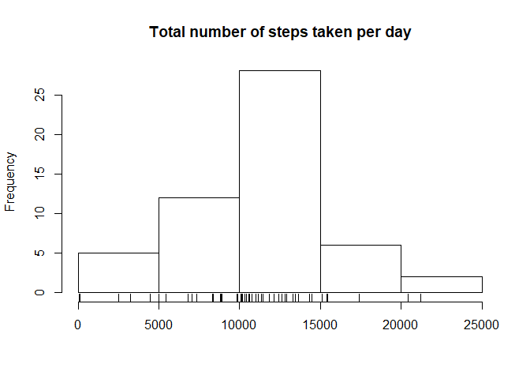
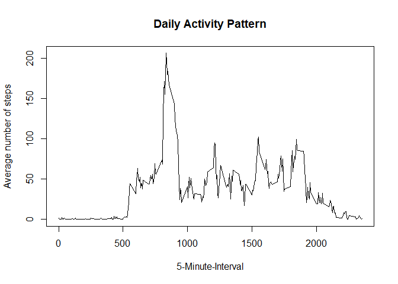
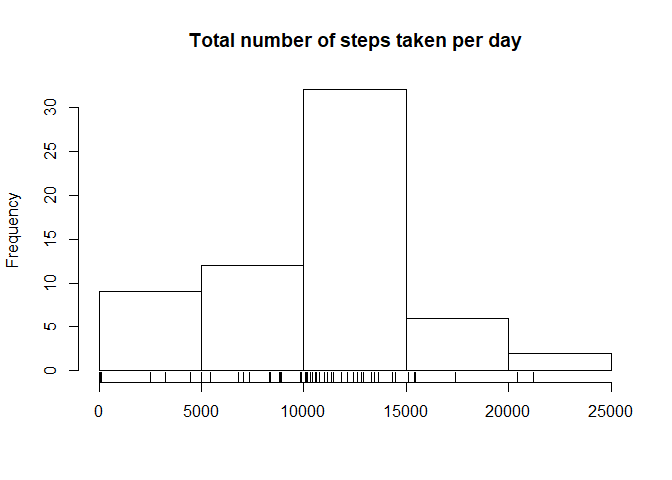
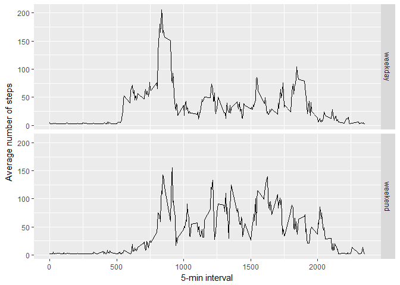

## Loading and preprocessing the data

First, we set the working directory, unzip the datafile and load its contents to the corresponding dataframe, right after running str() and summary() on it:


```r
setwd("~/1-ODN/Coursera/Universidade Johns Hopkins/Reproducible Research/RepData_PeerAssessment1")
unzip("activity.zip")
activity <- read.csv("~/1-ODN/Coursera/Universidade Johns Hopkins/Reproducible Research/RepData_PeerAssessment1/activity.csv", stringsAsFactors=FALSE)
str(activity)
```

```
## 'data.frame':	17568 obs. of  3 variables:
##  $ steps   : int  NA NA NA NA NA NA NA NA NA NA ...
##  $ date    : chr  "2012-10-01" "2012-10-01" "2012-10-01" "2012-10-01" ...
##  $ interval: int  0 5 10 15 20 25 30 35 40 45 ...
```

```r
summary(activity)
```

```
##      steps            date              interval     
##  Min.   :  0.00   Length:17568       Min.   :   0.0  
##  1st Qu.:  0.00   Class :character   1st Qu.: 588.8  
##  Median :  0.00   Mode  :character   Median :1177.5  
##  Mean   : 37.38                      Mean   :1177.5  
##  3rd Qu.: 12.00                      3rd Qu.:1766.2  
##  Max.   :806.00                      Max.   :2355.0  
##  NA's   :2304
```

Next, dates are converted to ymd format with lubridate and NAs are removed:


```r
library(lubridate)
```

```
## 
## Attaching package: 'lubridate'
```

```
## The following object is masked from 'package:base':
## 
##     date
```

```r
activity$date<-ymd(activity$date)
activity2<-activity[!is.na(activity$steps),]
summary(activity2)
```

```
##      steps             date               interval     
##  Min.   :  0.00   Min.   :2012-10-02   Min.   :   0.0  
##  1st Qu.:  0.00   1st Qu.:2012-10-16   1st Qu.: 588.8  
##  Median :  0.00   Median :2012-10-29   Median :1177.5  
##  Mean   : 37.38   Mean   :2012-10-30   Mean   :1177.5  
##  3rd Qu.: 12.00   3rd Qu.:2012-11-16   3rd Qu.:1766.2  
##  Max.   :806.00   Max.   :2012-11-29   Max.   :2355.0
```

## What is mean total number of steps taken per day?

Since we already got rid of the NAs, we'll use dplyr to help us to aggregate the data as needed:


```r
library(dplyr)
```

```
## 
## Attaching package: 'dplyr'
```

```
## The following objects are masked from 'package:lubridate':
## 
##     intersect, setdiff, union
```

```
## The following objects are masked from 'package:stats':
## 
##     filter, lag
```

```
## The following objects are masked from 'package:base':
## 
##     intersect, setdiff, setequal, union
```

```r
activity2.pd<-summarise(group_by(activity2,date),steps=sum(steps))
hist(activity2.pd$steps, main = "Total number of steps taken per day", xlab = "")
rug(activity2.pd$steps)
```

<!-- -->

```r
dailymean<-format(round(mean(activity2.pd$steps)))
dailymedian<-median(activity2.pd$steps)
```

Therefore, the mean total number of steps taken per day is 10766 and the median, 10765.

## What is the average daily activity pattern?

Now, we aggregate the data by 5-min intervals, taking the average nr. of steps at each corresponding interval:


```r
activity2.pint<-summarise(group_by(activity2,interval),steps=mean(steps))
with(activity2.pint,plot(interval,steps,type="l",xlab="5-Minute-Interval", main="Daily Activity Pattern", ylab="Average number of steps"))
```

<!-- -->

```r
maxStep.ind<-which(activity2.pint$steps==max(activity2.pint$steps), arr.ind = TRUE)
maxInt<-activity2.pint$interval[maxStep.ind]
maxStep<-round(activity2.pint$steps[maxStep.ind],1)
```

The interval with the maximum average number of steps throughout the days is 835 with 206.2 steps.

## Imputing missing values

Let's recall the amount of missing values in the dataset:


```r
nrMiss<-sum(is.na(activity$steps))
percMiss<-round(mean(is.na(activity$steps))*100,1)
```

Thus, there are 2304 missing values, which correspond to 13.1% of the total.

To estimate the missing values, we'll resort to the impute package from the Bioconductor project and store the results in the activity3 dataframe:


```r
library(impute)
act.wday<-wday(activity$date)
act.month<-month(activity$date)
act.knn<-cbind(activity$steps,act.month,act.wday)
colnames(act.knn)<-c("steps","weekday","month")
act.knn<-impute.knn(act.knn)
```

```
## Cluster size 17568 broken into 778 16790 
## Done cluster 778 
## Cluster size 16790 broken into 1412 15378 
## Done cluster 1412 
## Cluster size 15378 broken into 14040 1338 
## Cluster size 14040 broken into 6044 7996 
## Cluster size 6044 broken into 0 6044 
## Done cluster 0 
## Cluster size 6044 broken into 5776 268 
## Cluster size 5776 broken into 2085 3691 
## Cluster size 2085 broken into 875 1210 
## Done cluster 875 
## Done cluster 1210 
## Done cluster 2085 
## Cluster size 3691 broken into 1691 2000 
## Cluster size 1691 broken into 903 788 
## Done cluster 903 
## Done cluster 788 
## Done cluster 1691 
## Cluster size 2000 broken into 778 1222 
## Done cluster 778 
## Done cluster 1222 
## Done cluster 2000 
## Done cluster 3691 
## Done cluster 5776 
## Done cluster 268 
## Done cluster 6044 
## Done cluster 6044 
## Cluster size 7996 broken into 0 7996 
## Done cluster 0 
## Cluster size 7996 broken into 394 7602 
## Done cluster 394 
## Cluster size 7602 broken into 1950 5652 
## Cluster size 1950 broken into 943 1007 
## Done cluster 943 
## Done cluster 1007 
## Done cluster 1950 
## Cluster size 5652 broken into 2592 3060 
## Cluster size 2592 broken into 1710 882 
## Cluster size 1710 broken into 857 853 
## Done cluster 857 
## Done cluster 853 
## Done cluster 1710 
## Done cluster 882 
## Done cluster 2592 
## Cluster size 3060 broken into 0 3060 
## Done cluster 0 
## Cluster size 3060 broken into 1982 1078 
## Cluster size 1982 broken into 763 1219 
## Done cluster 763 
## Done cluster 1219 
## Done cluster 1982 
## Done cluster 1078 
## Done cluster 3060 
## Done cluster 3060 
## Done cluster 5652 
## Done cluster 7602 
## Done cluster 7996 
## Done cluster 7996 
## Done cluster 14040 
## Done cluster 1338 
## Done cluster 15378 
## Done cluster 16790
```

```r
head(act.knn$data)
```

```
##        steps weekday month
## [1,] 37.3826      10     2
## [2,] 37.3826      10     2
## [3,] 37.3826      10     2
## [4,] 37.3826      10     2
## [5,] 37.3826      10     2
## [6,] 37.3826      10     2
```

```r
activity3<-activity
activity3$steps<-act.knn$data[,1]
```

so we can assess the impact of imputing missing data on the estimates of the total daily number of steps.


```r
activity3.pd<-summarise(group_by(activity3,date),steps=sum(steps))
hist(activity3.pd$steps, main = "Total number of steps taken per day", xlab = "")
rug(activity3.pd$steps)
```

<!-- -->

```r
summary(activity2.pd$steps) # NAs removed
```

```
##    Min. 1st Qu.  Median    Mean 3rd Qu.    Max. 
##      41    8841   10765   10766   13294   21194
```

```r
summary(activity3.pd$steps) # NAs imputed using nearest neighbours
```

```
##    Min. 1st Qu.  Median    Mean 3rd Qu.    Max. 
##       0    8355   10765   10060   12811   21194
```

## Are there differences in activity patterns between weekdays and weekends?

First, we will create a factor variable in the activity3 dataframe with two levels - "weekday" and "weekend", indicating whether a given date is a weekday or weekend:


```r
activity3$wdf<-as.factor(c("weekday","weekend"))
activity3$wdf<-ifelse(wday(activity3$date)==1 | wday(activity3$date)==7, "weekend", "weekday")
```

Next, we use dplyr and ggplot2 to visualize the activity patterns split in weekdays and weekends:


```r
activity3.pint<-summarise(group_by(activity3,wdf,interval),steps=mean(steps))
library(ggplot2)
qplot(x = interval, y = steps, data = activity3.pint, facets = wdf~., geom = "line")+labs(x="5-min interval",y="Average number of steps")
```

<!-- -->

The above plot shows that the patterns do differ significantly.
